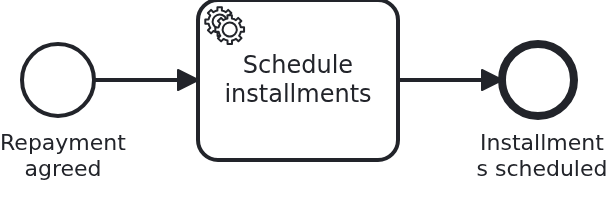

# An application built from several workflow modules

[](./LICENSE)

One workflow module is a JAR. Two are an application built out of parts, and that changes
three things: the modules need namespaces of their own, their identifiers have to be kept
apart inside the BPMS, and each of them has to make its own classes visible to the build of
the application. A delta on top of `module-single`.

The application in this blueprint contains no code at all. It is a POM with two
dependencies, and everything else the modules bring themselves.

## What this blueprint shows




Two use cases of an online banking application: a loan is approved, and later it is paid
back. Each is a workflow module of its own, with its own process, its own aggregate and its
own configuration, and neither imports a class of the other.

### Each module makes itself visible

The build of the application processes the application's own sources. A workflow module is a
Maven module of its own, so its classes are not among them, and a bean nobody knows about is
a bean that does not exist.

That is what the index is for, and every module carries the plugin building it:

```xml
<plugin>
  <groupId>io.smallrye</groupId>
  <artifactId>jandex-maven-plugin</artifactId>
  ...
</plugin>
```

The library `banking-commons` carries it as well, for exactly the same reason: it is a JAR
with beans in it.

**What happens without it** is worth knowing, because the symptom does not name the cause.
The marker file `META-INF/workflow-module` is enough for the module itself to be detected,
so its BPMN files are deployed; the classes are not found, so the process has no
`@WorkflowService` behind it and the build ends there. A module which is only resources
therefore needs no index at all, and one with classes always does.

### Two modules, one classpath, one engine

Nothing isolates two workflow modules from each other. They share a classpath, a database, an
HTTP port and a BPMS, so everything they name has to be unique, and this blueprint shows
where that bites:

- **Java packages and resources.** `blueprint.workflowmodule.loanapproval` and
  `blueprint.workflowmodule.loanrepayment`, and below `src/main/resources` one directory per
  module ID. A resource at the classpath root works in a single-module application and
  collides in this one, which is why the rule exists before it hurts.
- **Bean types.** Beans are resolved by type here, so two classes called `Service` in two
  packages are two beans and nothing collides. What does collide is anything sharing a name
  outside the type system, which is what the rest of this list is about.
- **JPA entities.** Both aggregates are called `Aggregate`, and one persistence unit cannot
  hold two entities of that name: `@Entity(name = "LoanRepayment")` gives the second one a
  name of its own, and the tables differ anyway.
- **HTTP paths.** `/api/loan-approval/...` and `/api/loan-repayment/...`, each named after
  its module.
- **Identifiers inside the BPMS.** Two modules may legitimately use the same BPMN process ID
  or message name. What keeps them apart is `name-clash-avoidance`, and this is the blueprint
  where it stops being a footnote.

### Keeping identifiers apart in the BPMS

This blueprint sets one mode and explains the others, because the choice belongs to the
operator rather than to the code:

```yaml
vanillabp:
  adapters:
    camunda7:
      name-clash-avoidance: use-prefix
```

(and the same for the other engine in its own profile file)

- `use-prefix`: VanillaBP prefixes every identifier with the workflow module ID before it
  reaches the engine and strips it off again on the way back. Nothing else notices:
  the BPMN files, the business code and the configuration all keep the plain names. No
  tenant is involved, which matters on a BPMS licensed per tenant.
- `by-adapter`: the engine's own isolation, a tenant per workflow module. The stronger
  separation, and the more expensive one.
- `none`: nothing is scoped, and the application promises that its identifiers are unique.
  The adapter warns about it at startup, and
  `vanillabp.adapters.<id>.accept-unscoped-identifiers: true` is how that promise is given.

**Changing the mode later is a migration, not a setting.** The identifiers a running workflow
was started with are the ones it is found by, so a switch leaves them unreachable. The way
across is a second adapter ID differing only in this setting, put first in
`vanillabp.prioritized-adapters`: new workflows start in the new mode, the running ones are
finished in the old one. [The wiki](https://github.com/vanillabp/adapter-platform-integration/wiki/Workflow-modules#how-name-clashes-are-avoided)
has the details.

### Shared code, and what must never be shared

`banking-commons` is a library JAR both modules depend on. It holds a value object (`Money`)
and a client for a system next door (`CustomerDirectory`), and it carries an index of its
classes the same way a module does, for the same reason.

What belongs in there is what has no opinion about a business case: technical helpers, value
objects, clients for systems both use cases talk to.

**What must never be shared:**

|        Never shared         |                                     Why                                     |
|-----------------------------|-----------------------------------------------------------------------------|
| a workflow aggregate        | it is the state of one business case, and sharing it merges the two         |
| a BPMN model                | a process belongs to exactly one module, and a copy is cheaper than a link  |
| a `ProcessService`          | it is typed by the aggregate, so sharing it means sharing that              |
| a `@WorkflowTask` handler   | it implements a task of one process, and that process belongs to one module |
| an entity of another module | it makes one module's schema the other one's contract                       |

Two modules needing the same aggregate are one module, not two. Two modules needing to talk
to each other is a different blueprint,
[`module-interaction`](https://github.com/vanillabp-blueprints/module-interaction-quarkus),
and the answer there is an API, never a shared class.

### A module brings its configuration per environment

Next to `loan-approval/loan-approval.yaml` sit `loan-approval-test.yaml` and
`loan-approval-prod.yaml`, and the active profile decides which of them applies on top of the
base file. Values only the module knows stay with the module; the application contributes the
things an environment really determines, and secrets come from outside the JAR entirely.

The profile lives in the **file name**, and a test sees it without any setup: a test runs in
the profile `test`, so `loan-approval-test.yaml` applies, while the BPMS profile of the build
keeps applying underneath it as the parent profile.
`ModuleConfigurationPerProfileIT` is the test which would notice if it did not.

Schema ownership belongs into this list and is deliberately missing from this blueprint: a
module which needs tables should manage them itself, initialized by its auto-configuration.
Showing it means bringing a migration tool in, which shifts what this blueprint is about, so
it stays with `ddl-auto` and the topic gets blueprints of its own.

## Delta to the base blueprint

Compared to [`module-single`](https://github.com/vanillabp-blueprints/module-single-quarkus):

|                              File                               |                                          What is different                                          |
|-----------------------------------------------------------------|-----------------------------------------------------------------------------------------------------|
| `loan-repayment/`                                               | the second workflow module, same structure, other use case, no shared code with the first           |
| `banking-commons/`                                              | the library both modules use, plus the auto-configuration contributing its bean                     |
| `loan-approval/.../loan-approval-test.yaml`, `-prod.yaml`       | new: the module's configuration per environment                                                     |
| `application/src/main/resources/application-camunda7.yaml`      | new: `name-clash-avoidance: use-prefix`, because two modules can collide                            |
| `application/src/test/.../ApplicationSmokeTest.java`            | asserts one `ProcessService` per module instead of "at least one", and sits next to the application |
| `application/src/test/.../ModuleConfigurationPerProfileIT.java` | new: proves that the module file of the active profile is the one that applies                      |

Everything else is the base blueprint: the wiring classes, the aggregates, the tests of the
modules, the way the BPMS is chosen.

## Running it

Requires a JDK 21. Camunda 7 is embedded, so nothing else has to run:

```bash
mvn install verify
```

Running it on another BPMS is a Maven profile, not one line of Java changes:

```bash
mvn install verify -Pcamunda8
```

Camunda 8 is a remote engine, so a cluster has to run; its address lives in
`application/src/main/resources/application-camunda8.yaml`, with a copy for each module's own
test.

Start the application:

```bash
mvn -pl application quarkus:dev
```

Two URLs start something, one per workflow module:

```
http://localhost:8080/api/loan-approval/start?customerId=C-1001&amount=5000
http://localhost:8080/api/loan-repayment/start?customerId=C-1002&amount=6000
```

Each answers with the ID of the case it started and logs the URL showing the result:

```
Loan approval '0f7c…' started: Ada Lovelace asks for 5,000 EUR
Credit rating of loan approval '0f7c…' is 50
Show the result -> http://localhost:8080/api/loan-approval/0f7c…
```

The names in those lines come from `banking-commons`, which is the shortest demonstration of
what a shared library is for: both modules ask the same directory the same question.

Prefixing becomes visible wherever the engine shows its deployments: the processes are named
`loan-approval-loan_approval` and `loan-repayment-loan_repayment` there, while everything in
this repository keeps calling them `loan_approval` and `loan_repayment`.

## How it works

|                                 File                                 |                                             Role                                              |
|----------------------------------------------------------------------|-----------------------------------------------------------------------------------------------|
| `application/pom.xml`                                                | the whole application: two module dependencies and the BPMS profile deciding the adapter      |
| `application/src/main/resources/application.yaml`                    | the database and the profile, and nothing about either module                                 |
| `loan-approval/pom.xml`                                              | the index plugin, which is what makes the module's classes visible to the application's build |
| `loan-approval/src/main/resources/loan-approval/loan-approval*.yaml` | the module's configuration, one file per environment, named by profile                        |
| `loan-repayment/...`                                                 | the same structure once more, for the second use case                                         |
| `banking-commons/.../Money.java`, `.../CustomerDirectory.java`       | the shared library: a value object and a client, nothing a process is made of                 |
| `application/src/test/.../ApplicationSmokeTest.java`                 | boots the application and counts the modules: one `ProcessService` bean per module            |
| `application/src/test/.../ModuleConfigurationPerProfileIT.java`      | proves the module file of the active profile wins over the module's base file                 |
| `loan-approval/src/test/.../LoanApprovalIT.java`                     | the module's own test, against the module alone, exactly as in the base blueprint             |

The order of events inside a module is the one of the base blueprint and does not change with
the second module: the API calls `Service`, `Service` tells `Workflow` what happened,
VanillaBP persists the aggregate and starts the process in the same transaction, and the
service task arrives in `WorkflowTaskHandler`.

What is new is what happens before any of that: the build reads the index of every JAR, the
beans of both modules and of the library become known, and VanillaBP finds two workflow
modules, deploys the BPMN files of both, and creates one `ProcessService` per aggregate. Add
a third module and none of the existing files change.

## Documentation

- [Workflow modules](https://github.com/vanillabp/adapter-platform-integration/wiki/Workflow-modules): what a workflow module is, its ID, and where its BPMN files are looked for
- [Defining a workflow module](https://github.com/vanillabp/adapter-platform-integration/wiki/Workflow-modules-in-Quarkus#defining-a-workflow-module): the marker file, the resource conventions and the module's own configuration files
- [Provide an index for workflow modules](https://github.com/vanillabp/adapter-platform-integration/wiki/Workflow-modules-in-Quarkus#provide-index-for-workflow-modules): why a module in a Maven module of its own needs one, and when it does not
- [Publishing a workflow module](https://github.com/vanillabp/adapter-platform-integration/wiki/Workflow-modules-in-Quarkus#publishing-a-workflow-module): what a module consumed by a foreign application needs, and what collides once two of them meet
- [How name clashes are avoided](https://github.com/vanillabp/adapter-platform-integration/wiki/Workflow-modules#how-name-clashes-are-avoided): the three modes, and why changing the mode is a migration
- [Configuration of a workflow module](https://github.com/vanillabp/adapter-platform-integration/wiki/Workflow-modules#configuration): the file names, the profiles and the priority order
- [Workflow aggregates](https://github.com/vanillabp/adapter-platform-integration/wiki/Workflow-aggregates): why there are no process variables
- the wiki of the [BPMS adapter](https://github.com/vanillabp/adapter-platform-integration/wiki/BPMS-adapters) you use: how a BPMN task has to be modelled for that engine

This blueprint is developed in the monorepo
[`blueprints`](https://github.com/vanillabp-blueprints/blueprints). This repository is a
read-only mirror, **issues and pull requests belong there.**

## Noteworthy & Contributors

[VanillaBP](https://www.github.com/vanillabp/spi-for-java) was developed by [Phactum](https://www.phactum.at) with the
intention of giving back to the community as it has benefited the community in the past.


## License

Copyright 2026 Phactum Softwareentwicklung GmbH

Licensed under the Apache License, Version 2.0

        https://www.apache.org/licenses/LICENSE-2.0

Unless required by applicable law or agreed to in writing, software distributed under the
License is distributed on an "AS IS" BASIS, WITHOUT WARRANTIES OR CONDITIONS OF ANY KIND,
either express or implied. See the License for the specific language governing permissions
and limitations under the License.
